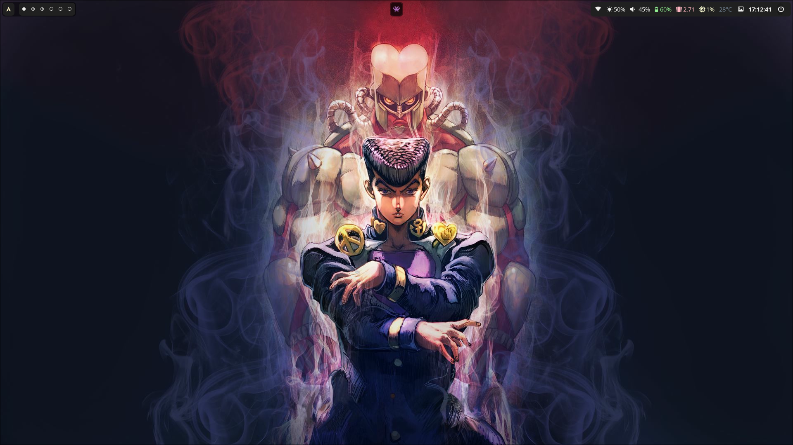
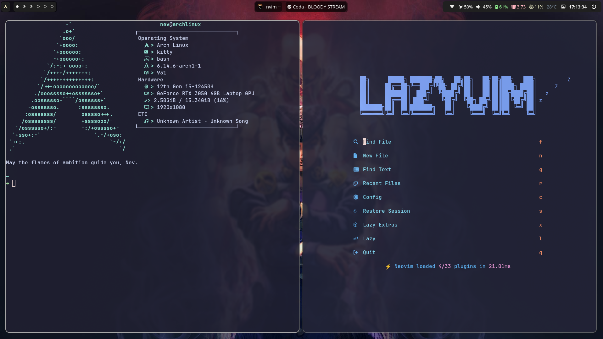
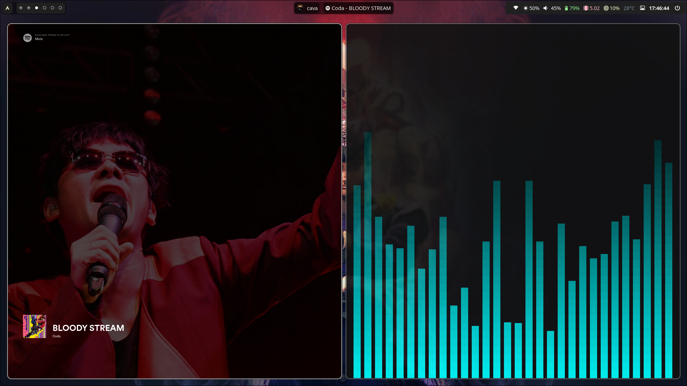

# ✨ Arch Linux Hyprland Dotfiles



Custom, minimal, and productive — this is my **dotfiles setup** for a modern Arch Linux desktop powered by **Hyprland**.

---

## 🔧 Tech Stack

| Component     | Tool                     |
|---------------|--------------------------|
| WM/Compositor | Hyprland (Wayland)       |
| Terminal      | Kitty                    |
| Shell         | Fish + Starship prompt   |
| Text Editor   | Neovim (LazyVim setup)   |
| Bar           | Waybar                   |
| System Info   | Neofetch                 |

---

<table>
<tbody>
<td align="center">
<br>

These dotfiles are for **[Arch Linux](https://archlinux.org)** based systems and **[Hyprland](https://hyprland.org)** as window manager<br>
If you liked the repo, give a star ⭐ — found a bug? Open an [issue](https://github.com/Ethics03/arch-dotfiles/issues/new)!


</td>
</tbody>
</table>

## 📸 Preview


Click on the image to see the preview! 👇

[](https://youtu.be/MlPf3jB7Ps8?feature=shared)






---

## 🚀 Features

- ⚡️ Hyprland + Kitty + Waybar = blazingly fast and aesthetic
- 🐟 Fish shell with autosuggestions and syntax highlighting
- 🧠 Neovim + LazyVim = perfect dev environment out of the box
- 🖥 Rounded corners, blur, transparency
- 🎯 Modular and clean configs
- 🎨 Consistent theme across terminal, bar, and editor

---

## 📁 Folder Structure

```bash
.config/
├── hypr        # Hyprland config (window manager)
├── waybar      # Status bar modules and theme
├── kitty       # Terminal config
├── fish        # Shell config and aliases
├── nvim        # LazyVim-powered Neovim setup
├── neofetch    # System fetch config

